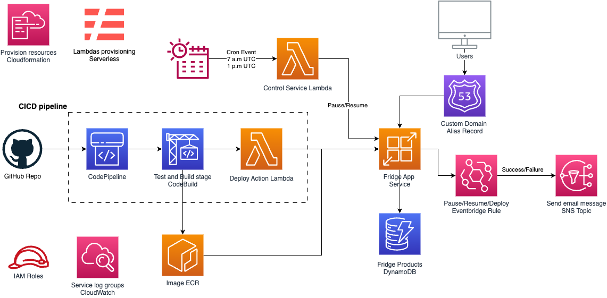

# Fridge App

 **Fridge App** is built with the objective to illustrate how a CICD pipeline works and how one can take control and monitor the resources that is using. It is just an quick and straighforward example of how to deploy a simple web app on AWS cloud.

## Architecture

The core AWS services used for this project are:

- **AppRunner**: the simplest way to deploy an app, you only need to provide the code, everything else is done for you.
- **CodePipeline** and **CodeBuild**: there are part of the *"Code"* family dedicated to create continuous integration and deployment pipelines.
- **EventBridge**: the serverless way of capturing data from your applications and services.
- **Lambda**: everybody talks about it nowadays. It is not only useful to build apps, it is also very powerful to control, monitor or take certain actions on your infrastructure.

The diagram illustrate the entire architecture of the web app. All resource are deployed via **CloudFormation** except for the Lambdas, which are deployed using **Serverless Framework** for easiness purpose. Let’s explain everything by parts:

1. **CICD pipeline**: every time there is a change on the *master* branch of the code repository, the CodePipeline is triggered. It source the code from GitHub, then it runs the test in CodeBuild and after there are passed an ECR image is created. The Lambda *deploy-action* starts a new “manual” deployment for the App Runner service with the already created image.
2. **App Runner**: it is a containeraized web app, static HTML templates are sent to the client with the data from a DynamoDB. 
3.**Events**: as AppRunner can get quite expensive, there are 
*cron* events that triggers a Lambda which *starts* or *resumes* its execution based on the received parameters. On the other hand, there is an EventBridge rule that listen the *success* or *failure* of these controlling actions and also of the launched deployments over the service. This way a message is sent to an SNS topic and the subscriptor are notified of these changes.
3. **Custom Domain**: registered and linked alias *DNS record* created with **Route53**, so users can find the web with a more readable URL.
4. **Roles, Policies and Logs**: the invisible part, but one of the most critical in the design of all the infrastructure.